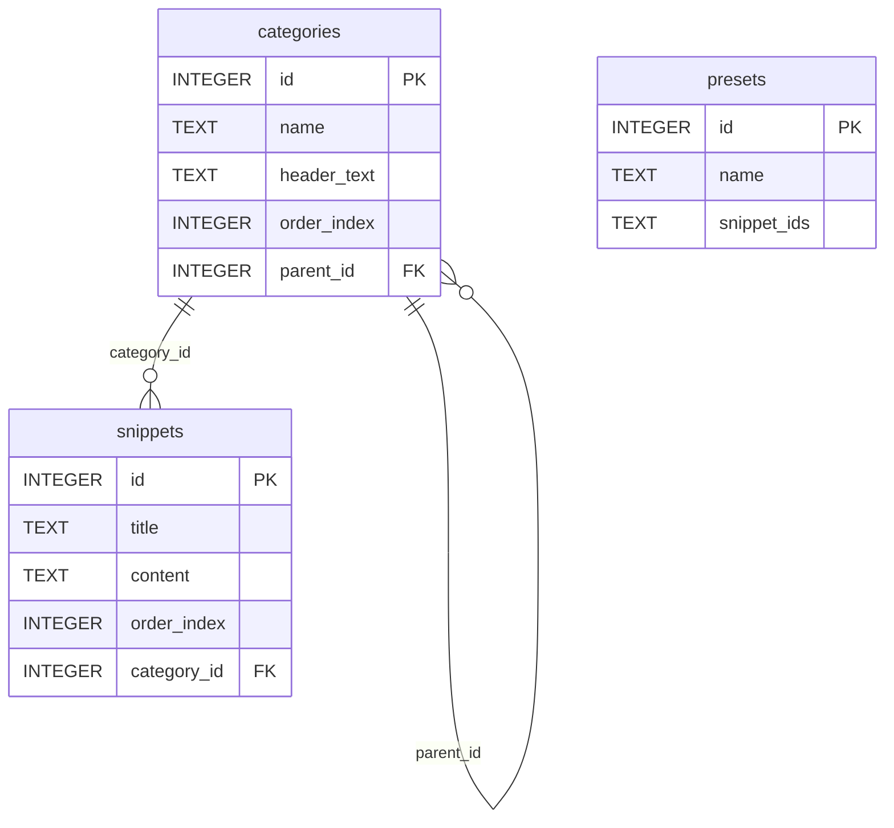

# 📝 InstructionCreator

InstructionCreator is a sleek, professional web application designed to dynamically compose prompt instructions, development guidelines, and custom configuration sheets (like `AGENTS.md`) by selecting modular prompt snippets grouped under hierarchical categories. 

Built with **Next.js (App Router)**, **TypeScript**, **Bootstrap 5 (Dark Mode)**, and **SQLite**, it offers modular settings dashboards, custom presets management, and extensive data portability.

---

## 🚀 Tech Stack

* **Framework:** Next.js 15 (App Router & Server Actions)
* **Language:** TypeScript (strict type safety)
* **Styling:** Bootstrap 5 (native styling with `data-bs-theme="dark"`)
* **Database:** SQLite (powered by `better-sqlite3` local relational storage)
* **Excel Porting:** SheetJS (`xlsx`) for formatting, generating, and parsing spreadsheets

---

## ✨ Features

### 1. Interactive Composition Terminal
* **Hierarchical Checklist**: Interactive tree list displaying infinite levels of nested categories and prompt snippets.
* **Terminal Preview**: Monospace live display block showing the combined prompt output in real time.
* **Smart Content Joiner**: Intelligently joins text blocks with single newlines (`\n`) for subtopics under the same header, and double newlines (`\n\n`) between primary category headings.
* **Portability Actions**: Fast clipboard copy and dynamic file downloading of the compiled instructions (e.g. as `AGENTS.md`).

### 2. Presets Manager
* **Save Checkbox Selections**: Capture your current checkbox choices into a named preset.
* **Load Selections**: Swap checklist configurations instantly by choosing a saved preset on the home screen.
* **Preset CRUD**: Rename presets or customize snippet assignments directly in the Settings Dashboard.

### 3. Modular Settings Dashboard
* **Manage Snippets**: Form to add/edit/delete snippets with custom category assignment.
* **Manage Categories**: Recursive hierarchical dropdowns to manage parent-child categories (with circular reference detection).
* **Auto-Sorting**: Optional order index. If left blank, newly created categories and snippets automatically assign themselves the next incremented order index (`MAX(order_index) + 1`).
* **Backups & Porting**: Full database backups and merges.

---

## 📊 Database Schema

The SQLite database file `instruction_creator.db` is stored locally and runs server-side via Next.js Server Actions:



---

## 📁 Porting & Backup Specifications

InstructionCreator supports robust backup and restore workflows in the **Settings > Backups & Porting** tab. All exports are generated with a strict text format code (`@`) to prevent spreadsheet tools like Excel or Google Sheets from auto-formatting numbers or truncating ID sequences.

### A. JSON Backup
* Saves a full database snapshot including categories, snippets, and presets.
* Useful for full migrations.

### B. Flat Excel Workbook (`.xlsx`)
* Generates a workbook with three tabs: `Categories`, `Snippets`, and `Presets`.
* Recreates exact ID mappings.

### C. Tree-Structured Single-Sheet Excel Workbook (`.xlsx`)
Designed to let users visually edit, relocate, and add prompts inside a single spreadsheet.
* **Categories & Snippets Sheet**:
  * **Columns A–E**: `Level 1 Category` through `Level 5 Category`. Subcategory levels are nested columns left-to-right.
  * **Header Text**: The markdown heading associated with a category (e.g. `## Tech Stack`).
  * **Snippet Title & Content**: The template title and body content.
  * **Type**: Marked as `Category` or `Snippet`.
  * **Database ID** & **Order Index**: (Optional) Kept to preserve direct preset links.
* **Reconstruction Engine**: On import, parent-child ID associations are dynamically resolved from the cell columns. If no ID is present, it matches names or registers new records automatically. Supports orphan snippets directly as well.

---

## 🛠️ Getting Started

### Prerequisites
* [Node.js](https://nodejs.org/) (v18.x or newer recommended)
* npm (comes with Node.js)

### Installation
1. Clone the project files into your desired workspace.
2. Open terminal in the project directory and install dependencies:
   ```bash
   npm install
   ```

### Running Locally
Run the Next.js development server:
```bash
npm run dev
```
Open [http://localhost:3000](http://localhost:3000) in your browser.

### Verification Check
Verify TypeScript compilation and type safety:
```bash
npx tsc --noEmit
```

### Production Build
Build and compile the application for production deployment:
```bash
npm run build
npm run start
```
